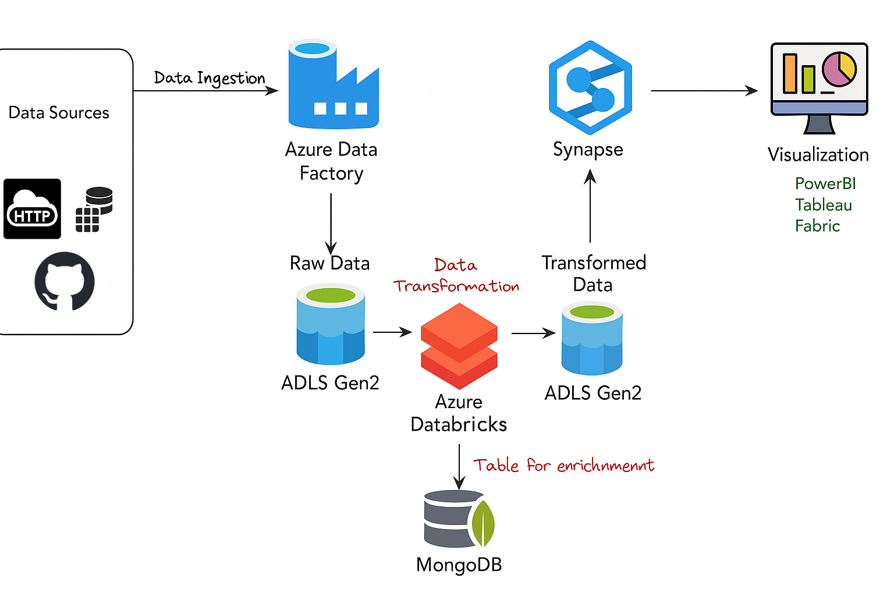

# End-to-End Data Engineering Pipeline on Azure

## Overview
Lightweight, production‑shaped data engineering demo using **Azure Data Factory** for ingestion, **ADLS Gen2** for storage, **Databricks** for ETL with **Delta Lake** (Bronze → Silver → Gold), and **Synapse serverless SQL** for serving.


---

## Executive Summary
- Ingest Olist CSV files → Bronze (Delta, partitioned by date for `orders`).
- Clean and standardize → Silver (dedupe, trim strings).
- Publish a tiny Gold mart: **daily_orders**.
- Query in Synapse via External Data Source + (example) CTAS/External Tables.

---

## 🛠️ Architecture


## Stack
- **Ingestion**: Azure Data Factory (ADF)  
- **Storage**: ADLS Gen2 (`raw`, `curated` containers)  
- **Compute**: Databricks (Spark + Delta Lake)  
- **Serving**: Synapse serverless SQL (External Tables / CETAS)

## Project Structure
```
Olist-Ecommerce-Azure-Project/
  adf/
  databricks/
    00_setup.md
    01_bronze_ingest.ipynb
    02_silver_transform.ipynb
    03_gold_marts.ipynb
    utils.py
  synapse/
    external_objects.sql
    gold_queries.sql
  data-sample/
    orders_sample.csv
  docs/
    architecture.png
  .gitignore
  README.md
  requirements.txt
```

## How to Run (Databricks)
1. Create/attach a cluster (DBR 13.x+).  
2. Open `databricks/01_bronze_ingest.ipynb`. Set widgets:
   ```python
   raw_base = "abfss://raw@<storage-account>.dfs.core.windows.net/olist"
   curated_base = "abfss://curated@<storage-account>.dfs.core.windows.net/olist"
   ```
3. Ensure the Olist CSV files are present in `raw/` (or place small test files in `data-sample/` and adjust the path).  
4. Run notebooks in order: **01 → 02 → 03**.  
5. You should see a Delta table `gold.daily_orders` created at `curated/gold/daily_orders`.

## Minimal Data Quality
- Bronze notebook asserts non‑empty loads.
- Silver notebook ensures **no duplicate `order_id`** and trims string columns.

## Synapse (Serverless) Setup
1. Open `synapse/external_objects.sql`, set your `<storage-account>`, and run to create:
   - `olist_ds` (External Data Source to ADLS Gen2 curated)
   - `parquet_ff` (External File Format)
2. Open `synapse/gold_queries.sql` and run to materialize `ext_gold_daily_orders` using **CETAS**‑style query.

## Security & Secrets
- Use **Azure Key Vault** or **Databricks Secret Scopes** for any JDBC user/password.
- Use **Managed Identity** for Synapse to read ADLS Gen2.

## Notes
- Keep only tiny samples in `data-sample/` for the repo. Link the full Olist dataset (Kaggle) in your GitHub description if desired.
- This repo intentionally keeps transformations **simple** to signal solid DE shape without heavy frameworks.
